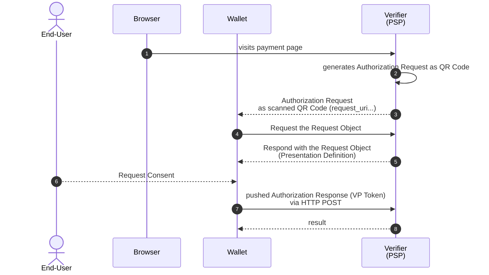

# Verifiable Presentation (aka Payment) 

## References

[OpenID for Verifiable Presentations - draft 22](https://openid.net/specs/openid-4-verifiable-presentations-1_0.html)

## Development Environment

### Endpoints

| Endpoint              | URI                                                                                  |
|-----------------------|--------------------------------------------------------------------------------------|
| Verification (Payment) Page | https://verifier.eudiw.dev/home                           |
| request_uri                 | https://verifier-backend.eudiw.dev/wallet/request.jwt/XXX |
| response_uri                | https://verifier-backend.eudiw.dev/wallet/direct_post     |

### Configuration

| Name              | Value                                                                                |
|-------------------|--------------------------------------------------------------------------------------|
| client_id         | verifier-backend.eudiw.dev |
| response_mode     | direct_post.jwt |
| response_type     | vp_token |
| client_id_scheme  | x509_san_dns |
|          |  |

## Flow sequence

## Sequence description:

1. End-User visits the payment page URL
2. Verifier generates the QR code which contains Authorization Request by reference: `request_uri` 
3. End-User scans the QR code
4. The Wallet sends an HTTP GET request to the `request_uri`  to retrieve the Request Object.
5. The HTTP GET response returns the Request Object containing Authorization Request parameters. It especially contains a Presentation Definition that describes the requirements of the Credential(s) that the Verifier is requesting to be presented.
6. The Wallet authenticates the End-User and gathers his/her consent to present the requested Credentials.
7. The Wallet sends the Verifiable Presentation(s) of the Verifiable Credential(s) to the Verifier an Authorization Response where the Verifiable Presentation(s) are contained in the vp_token parameter. This response is pushed via `HTTP POST`. End-point is identified via `response_uri` parameter. Response mode/format is identified via `response_mode` parameter.
8. Just a formal response with no need to be futher processed by the Wallet

## Sequence details

### 1. Verification (Payment) Page

https://verifier.eudiw.dev/home

### 3. QR code containing Authorization Request

    eudi-openid4vp://?client_id=verifier-backend.eudiw.dev&request_uri=https%3A%2F%2Fverifier-backend.eudiw.dev%2Fwallet%2Frequest.jwt%2FvrvQlOmySkY9f_s4wBPhDr2tB9vpgkmBzs1VzMqjEl34OBWttwaxaTW1884F87Cfe4fImx9-wpG2H1rhW78y5Q

Wallet parses the QR code and reads the `request_uri`

### 4. Request the Request Object

HTTP GET of the `request_uri`

    https://verifier-backend.eudiw.dev/wallet/request.jwt/vrvQlOmySkY9f_s4wBPhDr2tB9vpgkmBzs1VzMqjEl34OBWttwaxaTW1884F87Cfe4fImx9-wpG2H1rhW78y5Q

### 5. Response with the Request Object (Presentation Definition)

JSON body (shortened):

    {
        "response_uri": "https://verifier-backend.eudiw.dev/wallet/direct_post",
        "client_id_scheme": "x509_san_dns",
        "response_type": "vp_token",
        "nonce": "4c2d42af-c6c9-48fc-a4c2-90778aeda8ed",
        "client_id": "verifier-backend.eudiw.dev",
        "response_mode": "direct_post.jwt",
        "aud": "https://self-issued.me/v2",
        "scope": "",
        "presentation_definition": {
            "id": "2553e6a3-8983-4df4-a5a4-7d4b1c7ad877",
            "input_descriptors": [
                {
                    "id": "eu.europa.ec.eudi.pid.1",
                    "name": "Person Identification Data (PID)",
                    "purpose": "",
                    "format": {
                        "mso_mdoc": {
                            "alg": [ "ES256", "ES384", "ES512" ]
                        }
                    },
                    "constraints": {
                        "fields": [
                            {
                                "path": [
                                    "$['eu.europa.ec.eudi.pid.1']['family_name']"
                                ],
                                "intent_to_retain": false
                            },
                            ...

                        ]
                    }
                }
            ]
        },
        "state": "Ywk0n...KGlZQ",
        "iat": 1732018359,
        "client_metadata": {
            "authorization_encrypted_response_alg": "ECDH-ES",
            "authorization_encrypted_response_enc": "A128CBC-HS256",
            "id_token_encrypted_response_alg": "RSA-OAEP-256",
            "id_token_encrypted_response_enc": "A128CBC-HS256",
            "jwks_uri": "https://verifier-backend.eudiw.dev/wallet/jarm/Ywk0...KGlZQ/jwks.json",
            "subject_syntax_types_supported": [
                "urn:ietf:params:oauth:jwk-thumbprint"
            ],
            "id_token_signed_response_alg": "RS256"
        }
    }

Full version: [Click here](5-RequestObject-response.json)

### 7. Authorization Response (VP Token) as HTTP POST

This response is pushed via `HTTP POST`. End-point is identified via `response_uri` parameter (returned in step 5.). Response mode/format is identified via `response_mode` parameter (returned in step 5.).

HTTP POST to `response_uri`

HTTP Body:

    response=
    eyJhbGciOiJFQ0RILUVTIiwiYXB1IjoiY1dwRFZtZzNaM2RXUjJkNVEyeHZjSFZMY2xJMlFRIiwiYXB2IjoiWmpjeU4yWTRObVl0TlRJME1pMDBaalk0TFdJMll6UXRZelV4WVdJMU0yWTRaR0l4IiwiZW5jIjoiQTEyOENCQy1IUzI1NiIsImVwayI6eyJjcnYiOiJQLTI1NiIsImtpZCI6IjExODgzMDBDLThEN0ItNEVENy1BOTM0LTkyOERDRDVEQjQ3QiIsImt0eSI6IkVDIiwieCI6IjFaeTFnUHJmRlZGYlFqWmxjVXd2ZDdpNDlVV3Q3ODdrS0FfT0NpOE5JemsiLCJ5IjoidWR2OG1LYWZlV0ZMeThrTEFoQU9YM25qVDBpNExiblpaelg3ZENnYmt5WSJ9LCJraWQiOiJjMTg4MGUzNC1mYjE1LTRlMWQtYTFiNy1kZjBhNzkyZWUxNGYifQ..Ybubyozf9wBH034nvdDe_w.CJO622h57o4wFpnGwsuvRTAt3G1Kd7Uq1GrKYV84A4cWF7gKIoFvLYw9fbZk4MMdF2NuxFjSWV18vHQFz-gDrVyX7X2OIstAHV8jaOqhfX8rRv4NKTJ8qVz_iKgi7KDw-h8VUnvqCzgKfunonJAK-6ER49wvKw35FCHGHV-1Hv8-9Izv0zXDiqZUVxC2wYy4kOQ99jMy-GZOwSq3cUC3Q4JJFH9SSV8uauDbZddIYfgUQVofNrtc48fKkvTcM5FTNufbPHwCzUcew9AA4Rwqwk6gi_XR1NU1Ysiw253s_jVXXKqtF7Qo9ZrdmZ3gPN_bk5rVXh211GpVJM-Lw6zYPajJu8LIS-j_GkvZUzEd1zWL-xHVj1gsoOLm-KzHGG3_f0sxwlJbRNWDI002IdP7kFYrVs4nTD_pq7Q5kwhN3q12uCdVFSKYSgrsLPB3GjkudkQT9e7sOuNAGIpdAGgXSs1JaoU-kZbNAHd-1jXsoKe2zLTkhLJUR05FExl4mi2PhI3f5Na4Qf0Q1IVB9mmUiL9s1qPhUfBegwuTREWWFqmIJvpG---wqkkRQg-WoXDqBgWXzfXWLYNNLEAA24dMM6-3G6Mqo7RIzSMStbbGBeMdQBBb_Q4AdQ8toHwZ5U_m5Db05EoXQit2Z5s2Ea2CArn22Q98P8zI1ys9QU_LUKKmgAcQZjAZfzI9FmEhpKJnrq-klFV4COPZXhYWwRdOoX9JZObgQ0GpBGc338imq2fjYQDqyqv43t2dOupoOkX28Vs96QMtijWou04BsOChAr9y__SgxGpc_zcJcVtlDyoh3D0fPkgiBrH0U5HjEZIhzncXTSWqdhgiEAn6GYEeHT1LtkDlLLtTHJFcCMXRWnVdf8JoUU9lJG3hILFsgi_HGlnlphFkwaxKaRyE-nhQvpzms4PurX4X2Ql2z92quhHPBXqVxVrmBYeyvD53TMgJTPApL6nFjdut_IAtJd10-5y08q9uQ-dwq58Rbzq_YNLs7TiSvbWAOrdbXR9GNJ54sBWuv5khIVROH1ln6E1JUrDxLLlB-TRBWfqvC7169YGGQqDBjkZHTMBmmPaYIm6TL6bITv1V9nmDfvoYB9IOjtj3HPRCFcUODPGAQv3KOiwKEssa7bP-SmOFN2KyNurX1WBLUITiXFJD8xgVCoJmYt9xxSVirmnu4P1HnbEzmicQryt06-N_y0A7N5McMAb1Pty4UwBDWVKEC1wywZlRbgcHy0jBTe-qb7C7HTPPjCmJa0Hkocv_nqM2UKfIqgnIB0qOP-v3D-DBzJ2_UhrUtLcPaNQAf5-S2BYZHJhRp79j05fQJU7s0oVII8LVVEClYMvoN6oFo9KWJTd-4Djo-34vs1aMKiYZvXj_cGvQr4kHpugTdcqGhWsNTSlV8Aj78x4KINwJ01IgPCXmba0jDVTDoVLVFhB0qvUCiwC40BWDzV8ejzb1bdMQ5xXi4gZFdh7gEfK9aK4VsitlsO_CzgkBNANe3X5X9zTS70tBKgtGaHoEMiptq5HvevNpScOPy2TL7wvvwa_b9lNLxYcAjB9BkmJO6PsuTRCWhlv8Y9WskkKk--j74yUykyRhX5_jBfnMXYh2Hl40j3HcvSPUNlBx9v5X0sTVPPnMQv2BajG-iz7-hpPF4Xpt6_Y8Bqj7zCq8_WbGzHGBIU1BdaoKNppjDZuTSqVoS1XDBGEUMV0NPT8MH9_UEstBslEuZAHsGcyY35LbsibMXs5RPapq5M5EqvCPMYkUAfdKjlE5T1KPG4oPfsBqdfm5MameNKpSlON7jteYxe7pvLRGaOT6Iu9VSZV5vZsg-0L5aFvOvhb4iKV61Pkrk9Ptrbahd1BOUNdsH_bO9XkOXFHbPuTczeepCTgmvZAl5J4SdrK1WV2JaZvH76GjDCt95XDECRrI2pyFRuVgB6pykIsCiNX7MMCy3e9wN4LqOGByRqvuTJp46pTBXDfPMSaMGjsmbCEYcF-Lm9gvdGAifcHG1cm2FOIQd2ImLobK1fjHzTQPQJ1-tRksaeL-e6sKKrKBiALSheZmgAopDAMY56R34ObeHNM6Z8p0e665iUGD30cZdIbQYkgDntHtoHD0p1XPZxSJK5XdBSfUd6wDaaH-0yApwkzX-wCQSRV2ZH6PYwoNISoeH-JXSQPv0_cAMAtxU4-tEHU_7twVFeEhrE_hKQ97CEAVitZ--rURvSC7OMN5kOTqmZH0T5TeSpRwNSRSenXyuuzIJyM92j5NNq3Fx312QgpWaGONyVx-qjn11_GexotEfRD1Tl8Zvx-zPMQfeD2XhXg1DXLhFTMElG0wdfAlyGNknY9NDEdHn5ejmOiJGl9_dZ3RrNwQIqzMDH4iRt4ZnIUacKOkEe9xf8WAUu5sSWycz4IYwSYpvCwTq2BArOo8pJa78wcJGYXgEDNzX0QwNXFEdssWCVl-tBNaG5_qe3tnofAPasyAvq4yJCgVd3amQwfgaO-F8M97Rtylr-OwmdZ0pBZRsYuLlIhIZ68FIIyxI9xyaTcBk0BvPwg3ZqXs6Tdaar0_kvWy_l5SHO4de3_02uAwdlKTVET0LjWV7fGfz2DXQmDi_AUJT-yCQSPkya0xmvDu8ugujGxU5Vk_3JFlwePx6OR2w3dSC66GfEv4S2f_OH8MrJ0Phs9ASXAuZ_IlqC3_DxpatQ5DaGd3dOsr9pSH2l4aPb27vwGjvftrblHlvsYV-p_t7QLaIBkJAm5mHO_KS436zAgShKx9hyn9NTuNNKdJ-QO1czAp37vWeM66-sRGiRl1iE_BTPAOXjw28c1uo6Uxjdl_vkLMfC8PYg-R8nxoPhR8BdDVjIj2B6y1AqCn6r6LVosCVPg5nWA7oEBVDggw11yHuCs2epEV7T9CoO3tkVgOEjbicIKatuI1YQCEK85Ao2SYnhvDsyMHR_5tNjWO9PZqGTTQNA9KKaelP2HlyjM48BGGzjEjDv9kUtUxtKVustBht_goIHhe9YHQxtJbDCwrpxuKjwqS1fGIDtbQ9BXoQXr3tFrlmnUsXgEIv1hwI1rZbm2YtTPOxTZ1yfB7ZLSrRdszQ-tluEpFqRSCWWGZetH7ZrVuqIOe0ua4vk5kASdSS7rYy_16cJceyAj8TEtuRthGpMqTB-B8fp6XUProsyYEkpmToYMnSByqgnyqwflDNddZT58wfojnrgka7UJM9LQbhW8sQfVVRyhN6AT8JoSNVemLd7rcMFcGH5HGT4DSxkJGl_eyEZFw7_Dja9f2IreoBxE-rK-ZHPWWu73Gg7CnZcY3FO2akT9_Jlz9Bm4H39NwMHEmUcvdkLvzc88HJaYmKdE-fDmYT5uvwrWdU3T6Tt7i9BzlQI84KxJhakP_TsfhGp5qneBNlU5MQHjKu9ZWvxMmwNp0pgMOqGC64gXjUcKqABqc50HcLGwY0F5lN-3CbCkcDgvppZhVKZzItdGE5j3lhnY-AJcDln4GSNffeKgh8ZnHMfWyWxoRmMGnMGBHN5KF2fs14_plsNbJG96jwXILDGS_j-ddJ5X7NagJchm-nqAMuix6FpTrSEdGobV21g9UTB6lTTdiTe6bqSp1tfrHOIMQXC0MDNDneXZAJOYWVKxStEU33yK8AdAgy_NHPO_oCDH-aAky13BbuuNasOaW9uIMO1tVatcc1nG3SFk4k3QJ2gToZjhaAJAitEMX9Wqs21sEVJgafN-AmuZtm9PK4f0SeYgUz23HX6qjeEW1em0C2sBNn8UjJYDDZFAVXAlW6cVsH1ddXeU1nbazqks0mwzol1c4FhjHwKowaD6QofEC08WWh4nEw5evhRfKX4EHD102nxn52ONG-BBJrhBYFoXYAtNIJ8_Xc1rh4ohMKGIw5WBS61VyrZ7Y9ft-EPzUs_VBaAaBoH42P3DOSw1PWeuxOLvT8lzmV-qbs1foO9hGBsuuhAiPjTq79sV_6Y3_vpctD3Yrhxqm2_qFHxC3k5XQt6LmCtvnVNQUjwCUbcePMKdhDA6-EFlXHFY59ynoHB5UVAKs82OIxaT1efZ-jmN56AfY5GTP4Y-r-UaFb3Ste8xSTvskOhKuy15LHm_ofzkYiXxCcW5nL5Yoqynfp7GT_0LVv6-EPQZLFdGkOd9V9Mxhfpn7u593Se5USdt0ESp9ccQfsiYgWoJF40ddud7qsk5cl92m5a8j3i08iNWO8835_mf4sjpyaizkZ6vxKA2JF-CiwuFv7Uj5pA5iXJGkV4oqqQSmfnsh8zzcF8YezMPXLjXyaQTbN8MVoQyOUjLQfI03cbEinjySyte47pKw0KRsDpim22jroYkfWN80YkCi0C-xAx7kkW7LrS_JgJ-zVZCQKhQnBTAML8pkv6LmAKQSY21iWoquvA.7m7Ag5Z7bkRF3Iv4eadGuQ

    &vp_token=
    o2d2ZXJzaW9uYzEuMGlkb2N1bWVudHOBo2dkb2NUeXBld2V1LmV1cm9wYS5lYy5ldWRpLnBpZC4xbGlzc3VlclNpZ25lZKJqbmFtZVNwYWNlc6F3ZXUuZXVyb3BhLmVjLmV1ZGkucGlkLjGG2BhYVb9oZGlnZXN0SUQCZnJhbmRvbVAExFepwylGbMDIhNDk6F0bcWVsZW1lbnRJZGVudGlmaWVya2ZhbWlseV9uYW1lbGVsZW1lbnRWYWx1ZWVTbWl0aP_YGFhTv2hkaWdlc3RJRANmcmFuZG9tUOUL6DEBrSHSZ6s-ZaSj4w5xZWxlbWVudElkZW50aWZpZXJqZ2l2ZW5fbmFtZWxlbGVtZW50VmFsdWVkSm9obv_YGFhav2hkaWdlc3RJRAdmcmFuZG9tUMaCKWqkxm47VqTWaZ0yRD1xZWxlbWVudElkZW50aWZpZXJrZXhwaXJ5X2RhdGVsZWxlbWVudFZhbHVlajIwMzUtMDEtMDH_2BhYVb9oZGlnZXN0SUQGZnJhbmRvbVAGtAoqOhO_XO3epS2muWsXcWVsZW1lbnRJZGVudGlmaWVya25hdGlvbmFsaXR5bGVsZW1lbnRWYWx1ZWVDemVjaP_YGFhSv2hkaWdlc3RJRAFmcmFuZG9tUElvCMeE3d9RkbKbN7oVHXlxZWxlbWVudElkZW50aWZpZXJsYWdlX2luX3llYXJzbGVsZW1lbnRWYWx1ZRg2_9gYWFC_aGRpZ2VzdElEBWZyYW5kb21QjdJkIq8QFryzVRmdeXV_nHFlbGVtZW50SWRlbnRpZmllcmthZ2Vfb3Zlcl8xOGxlbGVtZW50VmFsdWX1_2ppc3N1ZXJBdXRohEOhASahGCFZAtcwggLTMIICeaADAgECAhQWOKLzLa7LNnDhfUgZGspmz_sEnDAKBggqhkjOPQQDAjBcMQswCQYDVQQGEwJDWjELMAkGA1UECAwCQ1oxDzANBgNVBAoMBlRoYWxlczEMMAoGA1UECwwDRElTMSEwHwYDVQQDDBhUaGFsZXMgSW50ZXJvcCAyMDIzIElBQ0EwHhcNMjQwNDE4MTMwNDU0WhcNMjUwNDE4MTMwNDU0WjA0MQswCQYDVQQGEwJDWjEVMBMGA1UECgwMVGhhbGVzIEdyb3VwMQ4wDAYDVQQDDAVUQ1A0STBZMBMGByqGSM49AgEGCCqGSM49AwEHA0IABIhWyaU_Q88qlBl1O0P4tAJCKWbUPtqvltcnXhiVTZGVxR7XnBCpVNinVn74KE-g_IZ0Nz9nALpsE-Hd51gP6KKjggE_MIIBOzAMBgNVHRMBAf8EAjAAMB8GA1UdJQEB_wQVMBMGCCsGAQUFBwMEBgcogYxdBQECMA4GA1UdDwEB_wQEAwIHgDAdBgNVHQ4EFgQUMJLzh3GevByHFJnuaZL-j7N70UgwHwYDVR0jBBgwFoAUS1E-7klzhTP5MQcvPZx7FduCjWwwXwYDVR0fBFgwVjBUoFKgUIZOaHR0cHM6Ly9kaXcuZHdnLmd3YWZldS5ldzEuZ3AtZGV2MDIuYWNsb3VkLmdlbWFsdG8uY29tL2NybC9pbnRlcm9wMjAyM0lBQ0EuY3JsMFkGA1UdEgRSMFCBFm1kbEBhY2xvdWQuZ2VtYWx0by5jb22GNmh0dHBzOi8vZGl3LmR3Zy5nd2FmZXUuZXcxLmdwLWRldjAyLmFjbG91ZC5nZW1hbHRvLmNvbTAKBggqhkjOPQQDAgNIADBFAiAPqiwjZXGdPrli7kasVzUoCn5xeX6djdjkbPFJAolrGwIhAMw7eqPXRCUPoEp22OfCpRK3G6Knpm96p1AMe2jBoao3WQJb2BhZAlamZ2RvY1R5cGV3ZXUuZXVyb3BhLmVjLmV1ZGkucGlkLjFndmVyc2lvbmMxLjBsdmFsaWRpdHlJbmZvpGZzaWduZWTAdDIwMjQtMTEtMDVUMTU6MTY6NDVaaXZhbGlkRnJvbcB0MjAyNC0xMS0wNVQxNToxNjo0NVpqdmFsaWRVbnRpbMB0MjAyOS0xMS0wNVQxNToxNjo0NVpuZXhwZWN0ZWRVcGRhdGXAdDIwMjQtMTEtMzBUMTU6MTY6NDVabHZhbHVlRGlnZXN0c6F3ZXUuZXVyb3BhLmVjLmV1ZGkucGlkLjGnAVggIn-GvTZyGhriIwsxU63A2dzKZWl3ojExHEYOlhUPUDACWCC1i9BN8VPdnIeEjJPHlH1AyX4KDrgOchD6vnG_33VlgwNYICihtciU82XhaLoRUfeCJZf8Wt7JTgD8FbPSnXBsvYY5BFggTp9bRfCnUTQ5LJ8I0YNiIWGW5r3Ek5WGLpwD-7wZU-YFWCDoBwAhb86iQgoJdRSUvQ3PHQukml6Pls7CaIbGslcqVgZYIIkhhqHZvqSZoiVky4tVFCaSYHYIIcT210ePdImOlzumB1ggp54u76Gxz0lUKRdWOqxt55SIUElKaN1H-l5oBkzBR-9tZGV2aWNlS2V5SW5mb6FpZGV2aWNlS2V5pAECIAEhWCD0El9rpkTc5dzggs3pTDsQzbDiS-k-bwv9z9Z1fuRmuSJYIAnG7DW5FoHdXMnKnrjTMeN0POxqssJsAAmP_LbVU_-ub2RpZ2VzdEFsZ29yaXRobWdTSEEtMjU2WEB-v-m5lsxLTWTSnh2cmTPAQGRE1K_efBRbXsXS89Qi_kKHcqPbF8ZZn5lzL8jmZlduc1o9opNKyncRgz7u71vWbGRldmljZVNpZ25lZKJqbmFtZVNwYWNlc9gYQaBqZGV2aWNlQXV0aKFvZGV2aWNlU2lnbmF0dXJlhEOhASag9lhAjQZgbjDIIhMziw0-qsNbQgT8YJNCaHq6vJBYGdZIfpjS48dn08KOo8MSl7jznjE_sq1w4M-eCw9tqJNcFMmVimZzdGF0dXMA

    &state=
    q712kA2yCBT7zF8bhycu8c-tdqJQytsKsVr8Nlx-hqoCexq-MF0zQEylPScxE0k9KVUmje7bMIS614PCla0zTg

Note: new lines added for better readability.

TODO: show response decoded...