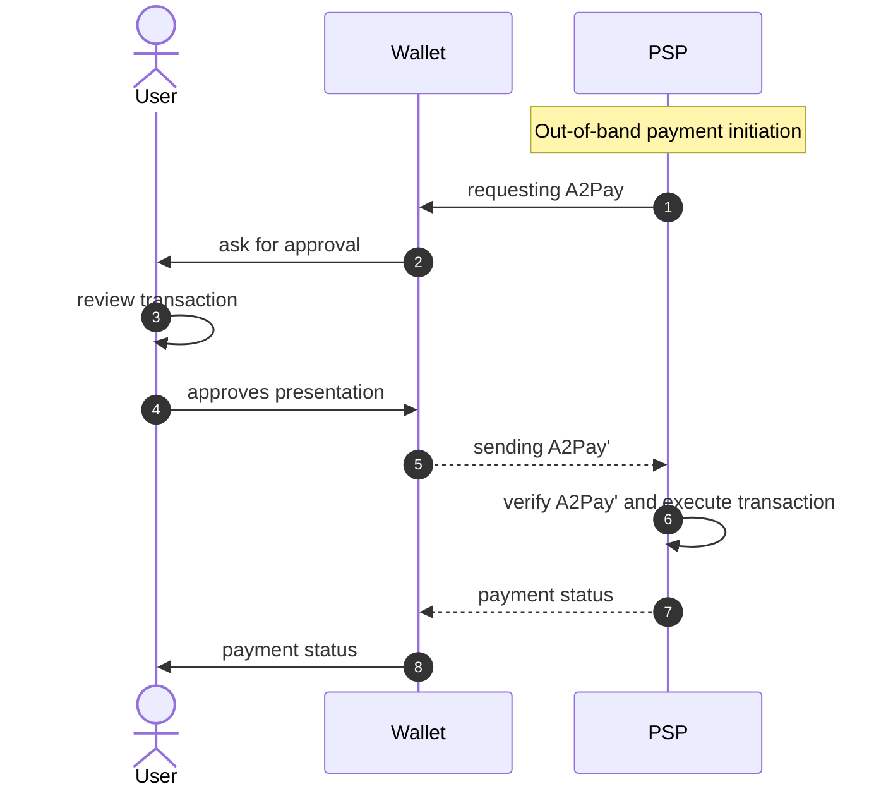
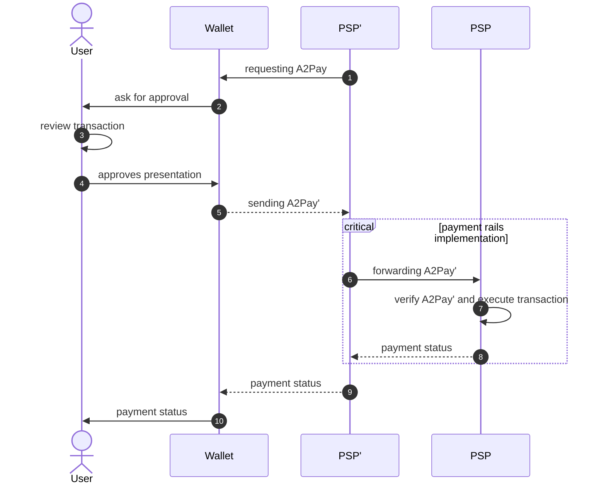

# Strong-customer-authentication for electronic payments for the eIDAS2 EUDI Wallet

## Background
Strong Customer Authentication (SCA) is a crucial requirement under the Revised Payment Service Directive (PSD2) aimed at enhancing the security of electronic payments. To meet SCA standards in open banking, banks must implement multi-factor authentication, typically involving two out of three factors: 

- knowledge (e.g., password or PIN)
- possession (e.g., mobile phone)
- and inherence (e.g., biometrics like fingerprint or facial recognition). 

This additional layer of security is essential to combat fraud in online transactions and protect both financial institutions and consumers. Today there exist multiple ways on how SCA can be performed. 

- **Redirected**: The Redirected SCA approach described in XS2A section 5.1.1[^xs2a] involves redirecting users to their bank's authentication interface during a payment transaction to complete the authorization process. This method presents a pre-populated credit transfer screen for the user's confirmation, making it a semi-automated process where the flow is controlled by the user, initiating the payment themselves Embedded
- **Embedded**: The Embedded SCA approach described in XS2A section 5.1.8[^xs2a] involves a fully automated process where the payment is initiated on behalf of the Payment Service User (PSU) by the Third-Party Provider (TPP). In this method, the user shares their credentials with the TPP, who then authenticates and initiates the payment in the background, embedding the authentication process seamlessly within the transaction flow.
- **Decoupled**: The Decoupled approach described in XS2A section 5.1.7[^xs2a] offers a convenient method to obtain SCA approval with minimal effort from the merchant or cardholder. This approach allows transactions to occur without the cardholder being actively engaged with the merchant's website or mobile application. Instead, authentication is conducted through alternative channels, such as mobile push notifications within banking apps, email, or other methods chosen by the Issuer bank to inform the cardholder of an authentication request from a merchant.

Dynamic linking is another key requirement under the Strong Customer Authentication (SCA) rules of the PSD2 for remote electronic payment transactions. It aims to ensure the integrity of the transaction by cryptographically linking the payment details to the customer's authentication. Here's how it works:

Dynamic linking requires at least two elements to be used for SCA compliance:

1. An authentication code or cryptogram that is uniquely linked to the specific payment amount and payee account. This is typically generated using the customer's authentication factors (e.g. biometrics, PIN, etc.)

2. The payment details themselves, including the amount and payee account details.

These two elements must be dynamically presented to the customer during authentication, ensuring they are verifying the actual payment details. The authentication code cryptographically binds the customer's identity to those payment specifics.

This prevents man-in-the-middle attacks where payment details could be modified after authentication. It also stops replay attacks reusing authentication codes across multiple transactions.

The dynamic linking process varies by authentication method, but often involves the customer's mobile app displaying the payment amount and merchant details alongside the authentication prompt. The authentication response then includes a cryptogram calculated over those payment details, dynamically linking them.

Article 5(1) of the Delegated Regulation (EU) 2018/389 states that: Where payment service providers apply strong customer authentication in accordance with Article 97(2) of Directive (EU) 2015/2366, in addition to the requirements of Article 4, they shall adopt security measures that meet each of the following requirements: 
1. the payer is made aware of the amount of the payment transaction and of the payee; 
2. the authentication code generated is specific to the amount of the payment transaction and the payee agreed to by the payer when initiating the transaction; 
3. the authentication code accepted by the payment service provider corresponds to the original specific amount of the payment transaction and to the identity of the payee agreed to by the payer; 
4. any change to the amount or the payee results in the invalidation of the authentication code generated.

In summary, dynamic linking is crucial for ensuring SCA provides true transaction integrity and non-repudiation under PSD2's remote electronic payment rules.

### eIDAS 2.0

The European Digital Identity Regulation (Regulation (EU) 2024/1183) obliges European payment service providers (PSP) to accept the EU Digital Identity Wallet (EUDIW) for SCA as [this paper](https://lange-hausstein.de/wp-content/uploads/2023/11/231120_DP-No.-1_EUDIW-for-SCA_EN_public.pdf) discusses in more detail.

### Architecture Reference Framework

Along with the regulation, the European Commision provides a set of technical specification and recommondations regarding the development of the European Digital Identity Wallet infrastructure through the Architecture Reference Framework (ARF)[^arf]. The ARF specifically proposes the following protocols for the remote issuing and presentation of Electronic Attestations of Attributes (EAA, see ARF Annex 1[^arf_annex1]). 

- **OpenID4VCI[^openid4vci]**
- **OpenID4VP[^openid4vp]** 

In order to be able to combine payment with other EAAs in a synergetic manner, this document in focusing on leveraging these specification to perform SCA and authorize electronic payment transactions as also referenced in ARF, section A.2.3.20 Topic 20[^arf_annex2].


## Registration
The (one-time) registration process links the holders wallet instance and their PSP managing the account used for payments. It also allows the PSP to establish a trust relationship to the wallet by verifying its authenticity as described in more detail in ARF, section 6.6.2[^arf].

During registration, the PSP aka issuer issues a dedicated EAA (hereinafter called A2Pay - Attestation to pay) to the wallet using OpenID4VCI [^openid4vci] according to the OpenID4VC High Assurance Interoperability Profile using SD-JWT VC (HAIP) [^openid4vc_hip]. OpenID4VCI allows the issuer to issue an EAA within an authenticated / authorized context. Exactly how this context is establish is left to the issuer and is out-of-scope of this document, however possible options and combinations of them are:

- Login credentials (OnlineBanking e.g.)
- OTP
- 2FA Apps (Propriatary Banking Apps e.g.)

As stated in ARF section 6.6.6.3, 6.6.3.7[^arf] and also ARF Annex 2 section A.2.3.9 Topic 9[^arf_annex2], the issued A2Pay is cryptographically linked to a private key protected by the Wallet Secure Cryptographic Application(s) (WSCA) and the corresponding Wallet Secure Cryptographic Device(s) (WSCD). During the issuing process, the corresponding public key is handed to the PSP which must store it along with the holders account data, as it must be used to verify payment transactions authorized / signed by the holder.

The private key constitutes the major factor to implement SCA within the wallet. Regarding its security, the following assumptions are made.
- the key to sign payment transactions is bound to the WSCD of the wallet and cannnot be extraxted. Therefor the key provides the factor possesion for SCA. AND
- the access to the key is always protected by a PIN only known to the holder OR biometrics providing the factors knowledge OR inherence. 

See also requirement specification ARF Annex 2 A.2.3.6 Topic 6 - User Approval RBA10[^arf_annex2] for details. 


### Attestation to pay - A2Pay

The A2Pay is used to identify the holders PSP and the account the attestation is linked to. In addition to that, the attestation may also state a payment rail along with required metadata that a relying party (merchant e.g.) might use to initiate a payment transaction.  

The data schema for A2Pay is described in detail within the json schema file [a2pay-schema.json](a2pay-schema.json).

Non-normative example of an A2Pay payload:

```json
{
    "_sd": [],
    "iss": "https://bank.com/issuer",
    "exp": 1883000000,
    "nbf": 1718198433,
    "iat": 1718198433,
    "vct": "https://credentials.example.com/a2pay",
    "_sd_alg": "sha-256",
    "id": "8D8AC610-566D-4EF0-9C22-186B2A5ED793",
    "payment-product": "sct-inst-eu",
    "initiation-url": "https://bank.com/pay/7dfe5484g78/init",
    "accountReference":{
        "iban": "DE75512108001245126199"
    },
    "currency": "EUR",
    "name": "Account John Smith",
    "display-name": "My Account",
    "cnf": {
      "jwk": {
        "crv": "P-256",
        "kty": "EC",
        "x": "NASJ2ADuagOvraLf7O4VxcBMbantzL9dd0jpvMLnBfs",
        "y": "OJY6pqCqRIzpEt78OXasWHGgqV5ZGre_3cHtpNH82gg"
        }
    }
}
```

Non-normative example of an A2Pay as `sd-jwt-vc` according to SD-JWT-based Verifiable Credentials[^sd-jwt-vc]

```
eyJ0eXAiOiJzZCtqd3QiLCJhbGciOiJFUzI1NiJ9.eyJpc3MiOiJodHRwczovL2JhbmsuY29tL2lzc3VlciIsImV4cCI6MTg4MzAwMDAwMCwibmJmIjoxNzE4MTk4NDMzLCJpYXQiOjE3MTgxOTg0MzMsInZjdCI6Imh0dHBzOi8vY3JlZGVudGlhbHMuZXhhbXBsZS5jb20vYTJwYXkiLCJpZCI6IjhEOEFDNjEwLTU2NkQtNEVGMC05QzIyLTE4NkIyQTVFRDc5MyIsInBheW1lbnQtcHJvZHVjdCI6InNjdC1pbnN0LWV1IiwiaW5pdGlhdGlvbi11cmwiOiJodHRwczovL2JhbmsuY29tL3BheS83ZGZlNTQ4NGc3OC9pbml0IiwiYWNjb3VudC1yZWZlcmVuY2UiOnsiaWJhbiI6IkRFNzU1MTIxMDgwMDEyNDUxMjYxOTkifSwiY3VycmVuY3kiOiJFVVIiLCJuYW1lIjoiQWNjb3VudCBKb2huIFNtaXRoIiwiZGlzcGxheS1uYW1lIjoiTXkgQWNjb3VudCIsImNuZiI6eyJqd2siOnsiY3J2IjoiUC0yNTYiLCJrdHkiOiJFQyIsIngiOiJOQVNKMkFEdWFnT3ZyYUxmN080VnhjQk1iYW50ekw5ZGQwanB2TUxuQmZzIiwieSI6Ik9KWTZwcUNxUkl6cEV0NzhPWGFzV0hHZ3FWNVpHcmVfM2NIdHBOSDgyZ2cifX19.vOwJu9CY40M84-_0oamO5oNMCymhzje9wYT6dxmt5SilzA11MIz-Bjn6tqhuCYQeQN0ZQLRGU5ilufP1b5mgAA~
```

## Presentation

Authenticating and authorizing a payment is implemented by presenting a signed presentation of the A2Pay (hereafter A2Pay') to a PSP using OpenID4VP[^openid4vp] according to OpenID4VC High Assurance Interoperability Profile with SD-JWT VC (HAIP) [^openid4vc_hip]. ARF section 6.6.3[^arf] explains this process in detail and also elaborates on how trust is established between the wallet and the PSP. A positive verification of an A2Pay' by the PSP authorizes the given payment transaction.

### Dynamic linking

As SCA also requires dynamic linking, the A2Pay' must also include the transaction details of the payment (payment request hereafter). The OpenID Foundation is currently developing an extension[^openid4vp_td] to the OpenID4VP[^openid4vp] specification to enable a relying party to incorporate dynamic data into the authorization request using the `transaction_data` parameter. A hash of this data will than be included into the key-binding JWK of the A2Pay' and represents the authentication code required by PSD2. The data contained within this parameter must also be included in the user approval dialogue of the wallet specified further in ARF section 6.6.3.4[^arf] and ARF Annex 2 A.2.3.6 Topic 6[^arf_annex2]. 

Since the support for transaction data is not part of the official OpenID4VP specification yet, refer to the `transaction_data` proposal branch on GithHub[^openid4vp_td] for implementation details.

### Payment transaction data

The data schema for the payment request is defined in detail within the json schema file [payment-request-schema.json](payment-request-schema.json). 

Non-normative example of a payment request:

```json
{
    "payment-id": "7D8AC610-566D-3EF0-9C22-186B2A5ED793",
    "creditor-account": {
      "iban": "DE75512108001245126199"
    },
    "instructed-amount": "15.49",
    "currency": "EUR",
    "creditor-name": "Merchant A",
    "purpose": "Shopping at Merchant A"
}
```

According to the transaction data specifications [^openid4vp_td], the following properties also have to be added to the object before base64url encoding to include it within the `transaction_data` array.

* `type`
* `credential_ids`
* `transaction_data_hashes_alg`

```json
{
  "type": "A2Pay",
  "credential_ids": "A2Pay",
  "transaction_data_hashes_alg": "sha-256",
  "payment-id": "7D8AC610-566D-3EF0-9C22-186B2A5ED793",
  "creditor-account": {
    "iban": "DE75512108001245126199"
  },
  "instructed-amount": "15.49",
  "currency": "EUR",
  "creditor-name": "Merchant A",
  "purpose": "Shopping at Merchant A"
}
```

Non-normative example of the `transaction_data` parameter within the authorization request:

```json
{
  "transaction_data": ["ew0KICAidHlwZSI6ICJBMlBheSIsDQogICJjcmVkZW50aWFsX2lkcyI6ICJBMlBheSIsDQogICJ0cmFuc2FjdGlvbl9kYXRhX2hhc2hlc19hbGciOiAic2hhLTI1NiIsDQogICJwYXltZW50LWlkIjogIjdEOEFDNjEwLTU2NkQtM0VGMC05QzIyLTE4NkIyQTVFRDc5MyIsDQogICJjcmVkaXRvci1hY2NvdW50Ijogew0KICAgICJpYmFuIjogIkRFNzU1MTIxMDgwMDEyNDUxMjYxOTkiDQogIH0sDQogICJpbnN0cnVjdGVkLWFtb3VudCI6ICIxNS40OSIsDQogICJjdXJyZW5jeSI6ICJFVVIiLA0KICAiY3JlZGl0b3ItbmFtZSI6ICJNZXJjaGFudCBBIiwNCiAgInB1cnBvc2UiOiAiU2hvcHBpbmcgYXQgTWVyY2hhbnQgQSINCn0"],
  ...
}

```

### Initiation scenarios 

The presentation process described above can be applied in various real-world use-cases that differ depending on the role of the relying party requesting the A2pay.

#### Direct Payment flow

In this scenario, the relying party is the PSP (usually a bank) of the holder themself. The holder is requesting a payment transaction using an out-of-band mechanism like the banks mobile app, online banking portal or even a third party provider for payment initiation according to PSD2 (PISP). The holders PSP is initiating the flow by requesting the A2Pay' they have previously issued to the wallet themself in the prior registration flow. 

This scenario applies to the obligations for PSPs to accept the wallet for SCA with regards to the eIDAS2 regulation.



#### Extended Payment flow

In this scenario, the relying party is a third party like a merchant or a merchant's PSP (PSP' hereafter) which is requesting the A2Pay' issued by the the holders PSP. After receiving the A2Pay', the PSP' must forward it to the issuing PSP for verification and/or execution of the payment transaction.



The details of forwarding the A2Pay' is out-of-scope of this document as it must be handled by according payment rails and schemes, which  must implement additional support for processing the A2Pay data structures and signatures. It may also include additional actors like payment platforms or aquirers e.g.. Possible solutions include the usage of existing OpenBanking API, payment networks or domestic schemes.

In order to support the extended payment flow and allow a PSP' to route an authorized payment request, the A2Pay must always provide the following details defined by the [A2Pay schema](a2pay-schema.json): 
- `payment-product`: The payment instrument or scheme to use.
- `accountReference`: The account / account alias the A2Pay is linked to. This can be an IBAN / BIC, a PAN or a mobile phone number.


##### PSD2 Berlin Group 

Although currently there is no out of-the-box support for payment initiation using an A2Pay in the existing Berlin Group specification yet, they already specify very similar concepts using a so called "signed payment request" within their Protocol Functions and Security Measures document for the  OpenFinance framework, section 7.1[^bg_sec]. A possible option would be to define an additional body signing profile for the `Body-Sig-Profile` parameter. The profile would define the requirements for wrapping the payment initiation requests into a verifiable presentation similar to the existing / forseen profiles `JAdES_JS`, `XAdES` and `EMV_AC`.

##### Domestic Scheme Bancomat

TODO

### Combined presentations

Relying on the presentation flows described above and also the requirements defined for the wallet in ARF Annex 2 section A.2.3.18 Topic 18[^arf_annex2], the PSP' may combine the request for an A2Pay' with additional attributes that may reside in the wallet. Therby they can leverage the additional information to build more advanced use-case like combining a payment with an proof of age e.g..

### Screenflow

Same-device screenflow of the payment process:


1. PSP' app initiates the process by requesting the presentation of an A2Pay including the payment request.
2. Redirect to wallet. Wallet asking the payer to approve the presentation of A2Pay including transaction details.
    - Consent must include biometrics or PIN.
3. Purchase is completed.


[^xs2a]: [NextGenPSD2 XS2A Framework Implementation Guidelines](https://www.berlin-group.org/_files/ugd/c2914b_fec1852ec9c640568f5c0b420acf67d2.pdf)
[^payment_data_model]: [Payment Data Model for Version 2.0 of the
openFinance API Framework](https://www.berlin-group.org/_files/ugd/c2914b_f8cab18ec71e476a9685c9a5f5260fda.pdf)
[^openid4vp]: [OpenID4VP](https://openid.net/specs/openid-4-verifiable-presentations-1_0.html)
[^openid4vp_td]: [OpenID4VP - Transaction Data Proposal](https://github.com/openid/OpenID4VP/blob/transaction_data/openid-4-verifiable-presentations-1_0.md)
[^openid4vci]: [OpenID4VCI](https://openid.github.io/OpenID4VCI/openid-4-verifiable-credential-issuance-wg-draft.html)
[^arf]:[Architecture Reference Framework](https://github.com/eu-digital-identity-wallet/eudi-doc-architecture-and-reference-framework/blob/main/docs/arf.md)
[^arf_annex1]: [ARF Annex 1](https://github.com/eu-digital-identity-wallet/eudi-doc-architecture-and-reference-framework/blob/main/docs/annexes/annex-1/annex-1-definitions.md)
[^arf_annex2]: [ARF Annex 2](https://github.com/eu-digital-identity-wallet/eudi-doc-architecture-and-reference-framework/blob/main/docs/annexes/annex-2/annex-2-high-level-requirements.md)
[^jar]:[ JWT-Secured Authorization Request](https://www.rfc-editor.org/rfc/rfc9101.html#name-jws-signed-request-object)
[^bg_sec]: [openFinance API Framework Implementation Guidelines, Protocol Functions and Security Measures](https://c2914bdb-1b7a-4d22-b792-c58ac5d6648e.usrfiles.com/archives/c2914b_db4be6e61a4e4581897d5758d2a4c8de.zip)
[^openid4vc_hip]: [OpenID4VC High Assurance Interoperability Profile with SD-JWT VC ](https://openid.net/specs/openid4vc-high-assurance-interoperability-profile-sd-jwt-vc-1_0.html)
[^sd-jwt-vc]: [SD-JWT-based Verifiable Credentials](https://datatracker.ietf.org/doc/draft-ietf-oauth-sd-jwt-vc/05/)
